# 🏪 SmartERP Pro - Système de Gestion de Stock

Un système ERP complet pour la gestion de stock et ventes, développé avec **Vue.js 3** et **Laravel**, **conteneurisé avec Docker** (avec support localStorage pour fonctionnement hors-ligne).


## 🎯 Fonctionnalités Principales

- ✅ **Gestion de Stock Complète** - Ajout, modification, suppression de produits
- ✅ **Point de Vente (POS)** - Interface de vente rapide et intuitive
- ✅ **Dashboard Analytics** - Graphiques et statistiques en temps réel
- ✅ **Gestion Multi-Utilisateurs** - Comptes séparés par email
- ✅ **Rapports Détaillés** - CA, ventes, stock par période
- ✅ **Support Hors-Ligne** - Fonctionne sans connexion internet (localStorage)
- ✅ **Interface Responsive** - Compatible mobile et desktop
- ✅ **Conteneurisation Docker** - Déploiement en une commande

## 🏗️ Architecture Docker

```
┌─────────────────────────────────────────────────────┐
│                     Nginx :80                        │
│              (Reverse Proxy + SPA)                   │
└──────────┬───────────────────────┬───────────────────┘
           │ /api/*                │ /*
           ▼                       ▼
┌──────────────────┐    ┌──────────────────────┐
│  Laravel API     │    │  Vue.js 3 Frontend   │
│  (PHP-FPM :9000) │    │  (Nginx SPA :80)     │
└────────┬─────────┘    └──────────────────────┘
         │
         ▼
┌──────────────────┐
│  MySQL 8.0 :3306 │
│  (stock_mgmt DB) │
└──────────────────┘
```

## 🐳 Démarrage rapide avec Docker

### Prérequis

- [Docker Desktop](https://www.docker.com/products/docker-desktop/) installé

### Lancement en une commande

```bash
# Cloner le projet
git clone https://github.com/Bayane-max219/Gestion-de-stock.git
cd Gestion-de-stock

# Démarrer tous les services
docker compose up -d --build

# L'application est disponible sur http://localhost
```

### Commandes utiles

```bash
# Voir les logs en direct
docker compose logs -f

# Arrêter les services
docker compose down

# Réinitialiser la base de données
docker compose down -v && docker compose up -d --build

# Lancer les migrations manuellement
docker compose exec backend php artisan migrate --force

# Accéder au shell du backend
docker compose exec backend sh
```

## 🛠️ Technologies Utilisées

### Frontend
- **Vue.js 3** (Composition API)
- **Vite** (Build tool)
- **Vue Router** (Navigation)
- **Pinia** (State management)
- **TailwindCSS** (Styling)
- **Chart.js** (Graphiques)

### Backend
- **Laravel 12** (API REST)
- **MySQL 8** (Base de données)
- **Laravel Sanctum** (Authentification)
- **maatwebsite/excel** (Export Excel)
- **barryvdh/laravel-dompdf** (Export PDF)

### Infrastructure Docker
- **Nginx** (Reverse proxy + serveur SPA)
- **PHP 8.2-FPM** (Runtime Laravel)
- **MySQL 8.0** (Base de données)
- **Docker Compose** (Orchestration)

## 🔧 Installation sans Docker (développement local)

### Frontend

```bash
cd frontend
npm install
npm run dev
# → http://localhost:5173
```

### Backend Laravel

```bash
cd backend
composer install
cp .env.example .env
php artisan key:generate
# Configurer .env avec vos credentials MySQL
php artisan migrate
php artisan serve
# → http://localhost:8000
```

## 👤 Comptes de Démonstration

```
👤 Franco (Pharmacie)
Email: franco@gmail.com
Mot de passe: I love teko.

👤 Fatima (Quincaillerie)
Email: fatima@gmail.com
Mot de passe: quincaillerie
```

## 📸 Screenshots

### 01 – Page d'inscription
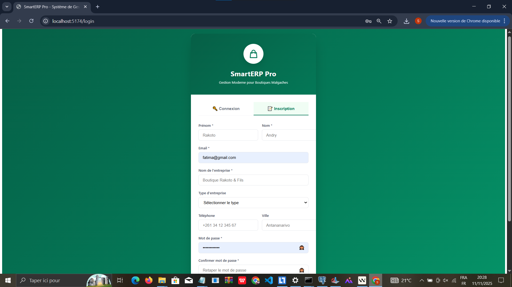

### 02 – Page de connexion
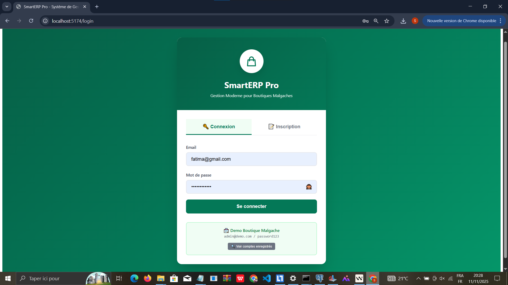

### 03 – Tableau de bord (vue globale)
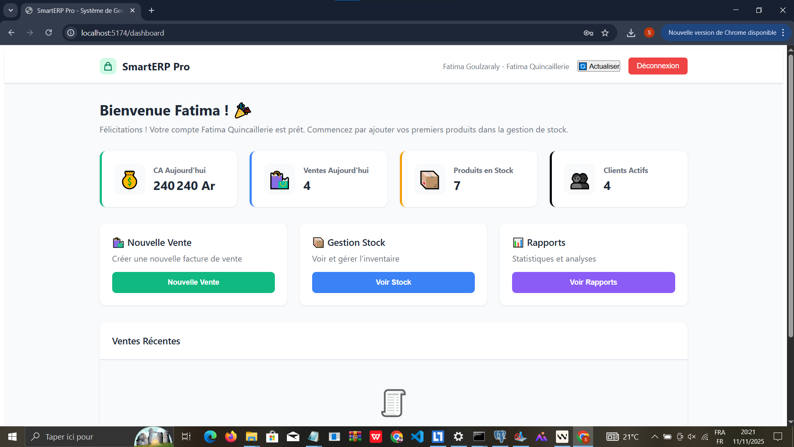

### 04 – Ajout de stock
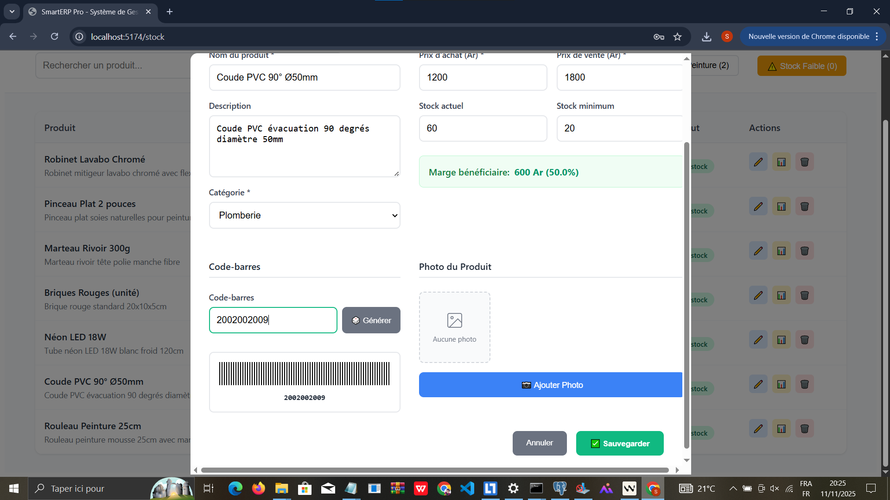

### 05 – Vente (écran 1)
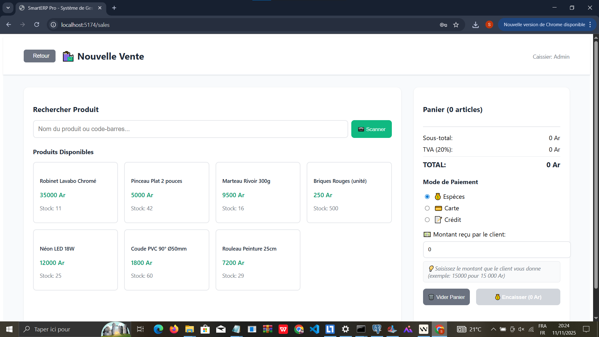

### 06 – Scan du produit (code-barres)
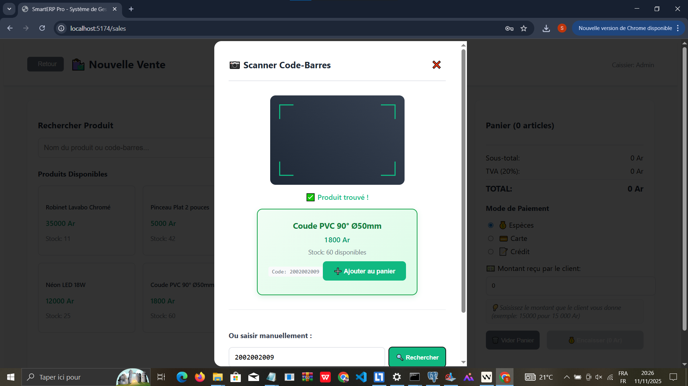

### 07 – Vente (écran 2 / confirmation)
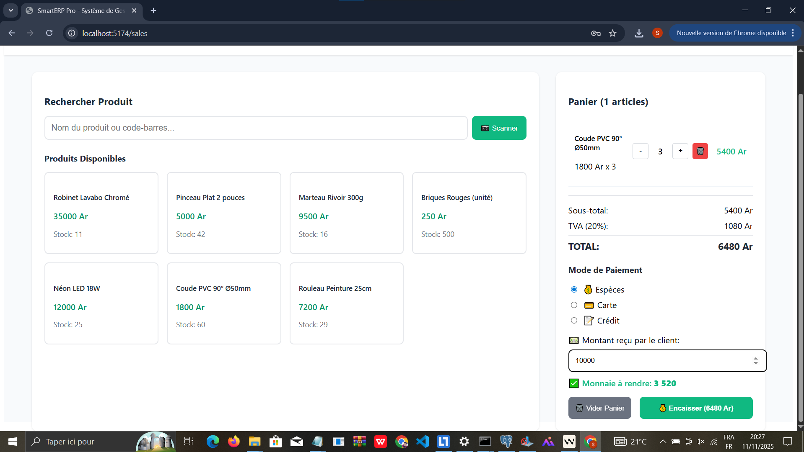

### 08 – Rapport de ventes (vue 1)
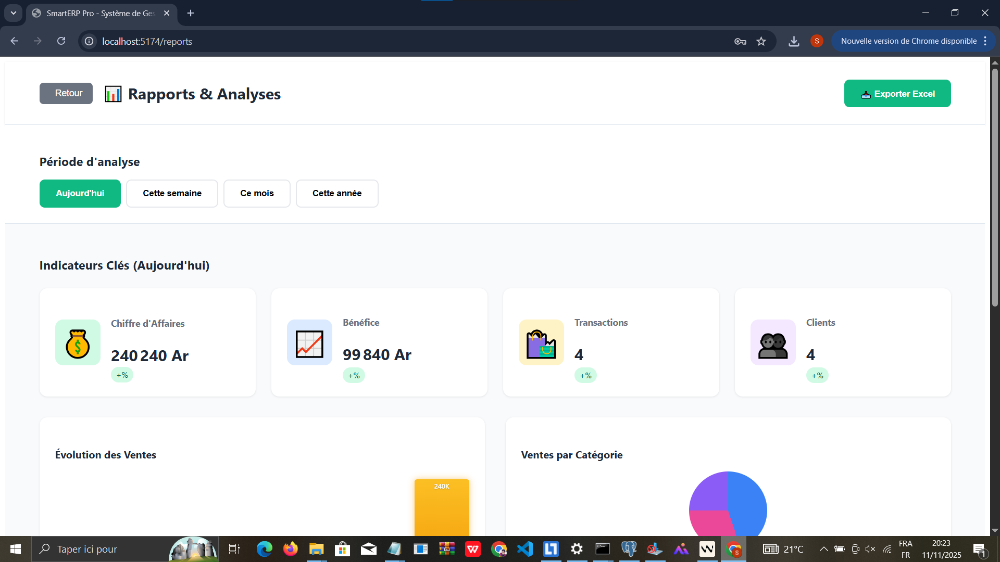

### 09 – Rapport de ventes (vue 2)
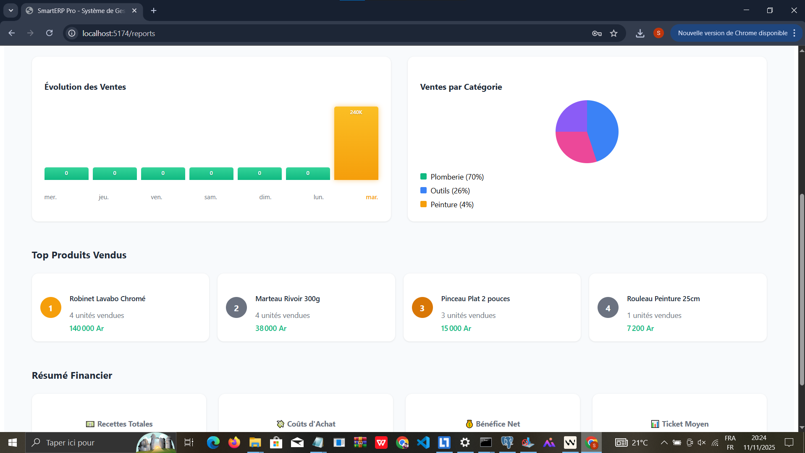

### 10 – Rapport détaillé (vue 3)
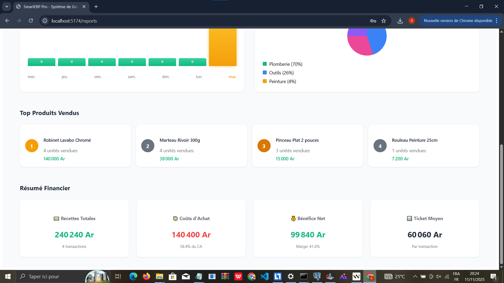

### 11 – Vue détaillée du stock
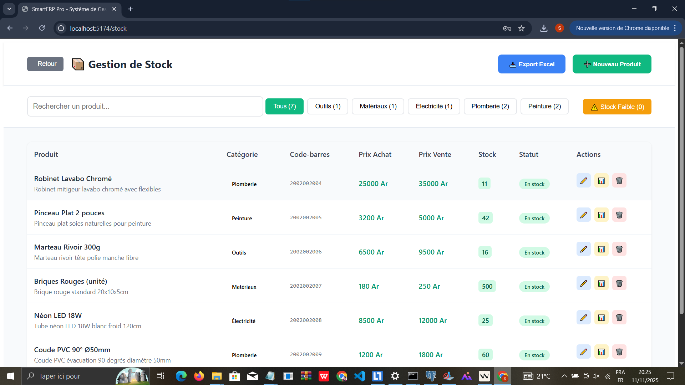

## 📁 Structure du Projet

```
Gestion-de-stock/
├── docker-compose.yml          # Orchestration des services
├── docker/
│   ├── nginx/
│   │   └── default.conf        # Nginx reverse proxy
│   ├── php/
│   │   ├── php.ini             # Configuration PHP
│   │   └── entrypoint.sh      # Script de démarrage Laravel
│   └── mysql/
│       └── init.sql            # Initialisation MySQL
├── backend/                    # API Laravel 12
│   ├── Dockerfile              # Image PHP 8.2-FPM multi-stage
│   ├── app/
│   ├── routes/
│   └── ...
└── frontend/                   # App Vue.js 3
    ├── Dockerfile              # Image Node.js + Nginx multi-stage
    ├── src/
    └── ...
```

## 📝 Licence

Ce projet est développé par **Bayane-max219** pour des fins éducatives et de démonstration.

## 🤝 Contact

- **GitHub**: [Bayane-max219](https://github.com/Bayane-max219)
- **Email**: baymi312@gmail.com

---

⭐ **N'hésitez pas à mettre une étoile si ce projet vous plaît !** ⭐